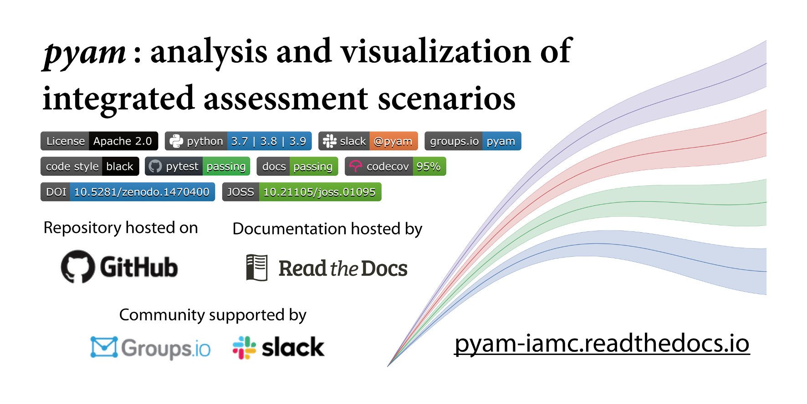

# Data wrangling scripts for the "IEA Net Zero by 2050" Scenario 

Copyright 2021 Daniel Huppmann

[](https://github.com/danielhuppmann/iea-netzero2050-datawrangler/blob/main/LICENSE)
[](https://github.com/IAMconsortium/pyam)

## Scope and aim

This repository contains scripts and notebooks to transform the data supporting the
IEA's [Net Zero by 2050](https://www.iea.org/reports/net-zero-by-2050) flagship report
(published May 2021) to the IAMC format.

## Input data

Please download the data files from the [IEA Net Zero by 2050 data page](https://www.iea.org/data-and-statistics/data-product/net-zero-by-2050-scenario)  
and save them in the [data](data) folder of the cloned or downloaded repository.

## Output data

The scripts and notebooks in this repository extract the data from the Excel spreadsheets
of the Annex and each chapter's figures and tables and transform it to the format
established by the
[Integrated Assessment Modeling Consortium](https://www.iamconsortium.org) (IAMC)
and used in recent reports of the [Intergovernmental Panel on Climate Change](https://www.ipcc.ch) (IPCC)
as well as several EU Horizon 2020 projects.

| **model** | **scenario** | **region** | **variable**   | **unit** | **2005** | **2010** | **2015** |
|-----------|--------------|------------|----------------|----------|----------|----------|----------|
| MESSAGE   | CD-LINKS 400 | World      | Primary Energy | EJ/y     |    462.5 |    500.7 |      ... |
| ...       | ...          | ...        | ...            | ...      |      ... |      ... |      ... |

*An illustration of the IAMC template using a scenario
from the [CD-LINKS](https://www.cd-links.org) project*  
*via the The [IAMC 1.5°C Scenario Explorer](https://data.ece.iiasa.ac.at/iamc-1.5c-explorer)*

## Dependencies

[](https://pyam-iamc.readthedocs.io)

The Python package **pyam** was developed to facilitate working with timeseries data
following the data format developed by the IAMC.
Features include validation of values, aggregation and downscaling of data,
and import/export (i/o) with various file formats (`xlsx`, `csv`, ...)
and table layouts (wide vs. long data).

[Read the docs](https://pyam-iamc.readthedocs.io) for more information!

### TL;DR - Quick install

You can install **pyam** and all its dependencies via the
[Python  Package Index (PyPI)](https://pypi.org/project/pandas)
and on [Conda](https://docs.conda.io/en/latest/).

```sh
# conda
conda install -c conda-forge pyam
```

```sh
# PyPI
pip install pyam-iamc
```

## License

The scripts and notebooks in this repository are licensed
under the **Apache License, Version 2.0**;  
see the [LICENSE](LICENSE) and [NOTICE](NOTICE.md) for details.
